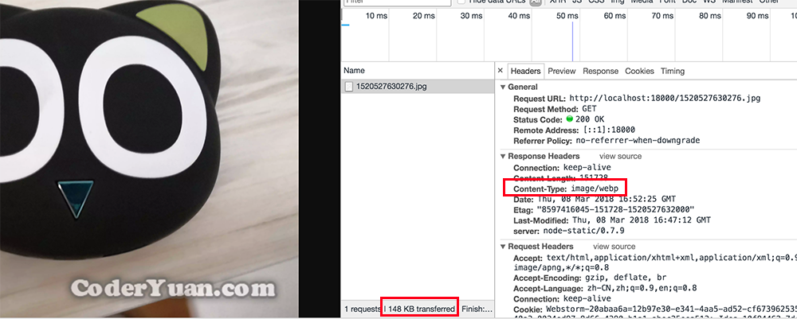
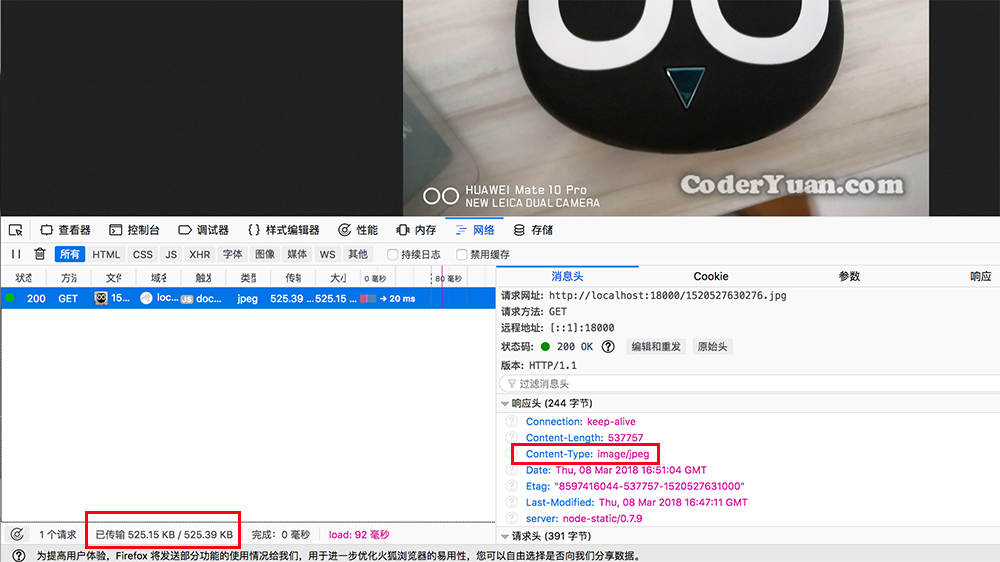
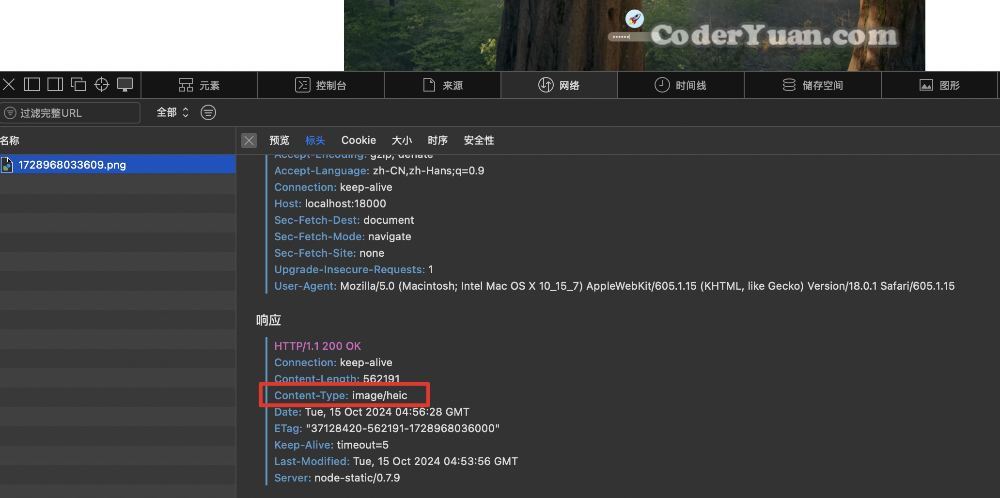
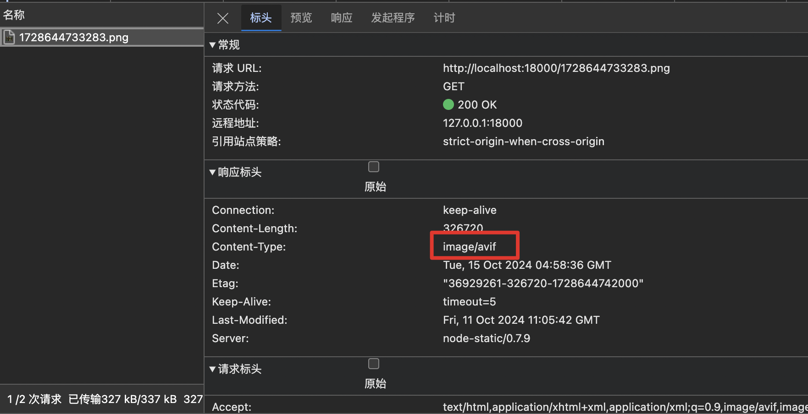

# coderyuan-image-server

A simple image server by using Node.js!

[中文文档](README_cn.md)

## Requirements:

**OS**: Linux or macOS, not support Windows.

**libvips**:

macOS:

    brew install vips

Linux:

Building from sources is suggested.
   
Please follow the documents on libvips officical site. https://www.libvips.org/install.html

Image converting will not available while libvips has not been installed or lacking some format support.

## Features:

### Image Transmit Service:

Parsing HTTP request's headers, according to **Accepts**, response a PNG/JPG/GIF image or WebP/HEIC/AVIF image (if file existed) automaticly.

#### Chrome:



#### Firefox:



### Safari:



### Edge:



### Image Upload Service:

The server provides a HTTP API to POST an image file with AccessToken. At the same time, you can set whether or not attaching a watermark and converting to WebP format.

All the configs in the **[config.yml](config.yml)**

If you don't want to create a page to upload, you can use **cURL**, like: 
```bash
curl -F "image=@IMG_20171122_212957.jpg" http://localhost:18001/?accessToken=000&nomark=0   # nomark=1 if you don't want to attach water mark.
```
After uploading, server will response:
````json
{
    "status":0,
    "data":
    {
        "url":"http://localhost:18000/1520529341826.jpg"
    }
}
````
Field **URL** means the full URL for fetching image.


## Run:

#### 1. Clone

```bash
git clone https://github.com/yuanguozheng/coderyuan-image-server && cd coderyuan-image-server
```

#### 2. Install Global Node.js Dependencies

```bash
npm i -g node-addon-api node-gyp
```

#### 3. Install Dependencies

Use ```yarn``` or ```npm install```

#### 4. Start

```npm start```


If the server has been launched normally, the terminal will get:

```
[2018-03-09 00:47:01.046] - INFO	  Resolver service has been started, port: 18000
[2018-03-09 00:47:01.050] - INFO	  Uploader service has been started, port: 18001
```

After running server, you can config reverse proxy for nginx to access by your domain!
